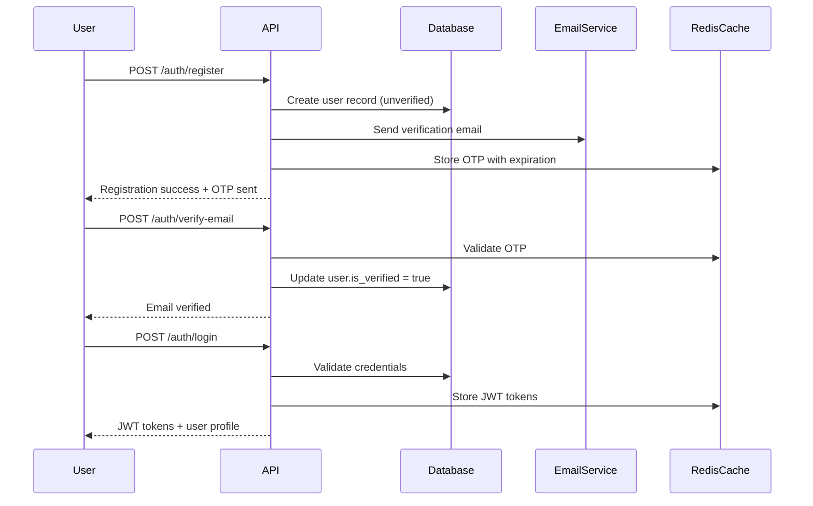
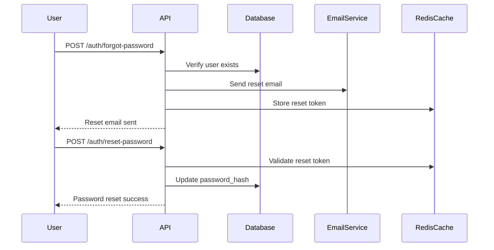
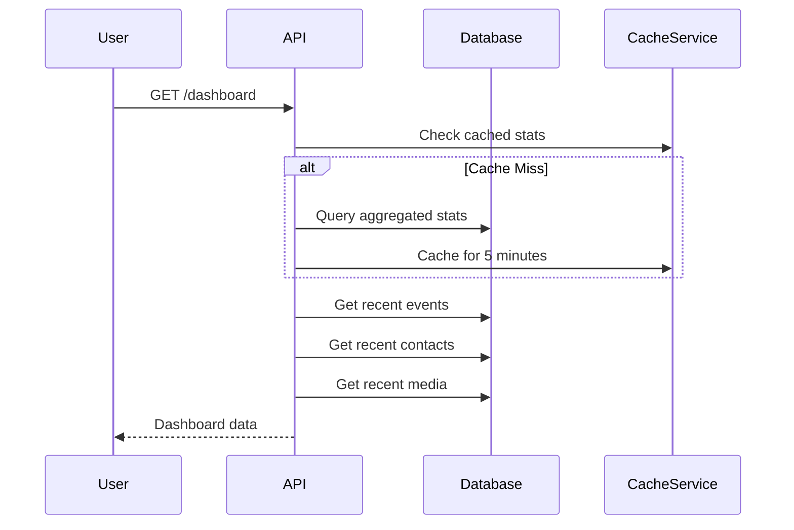
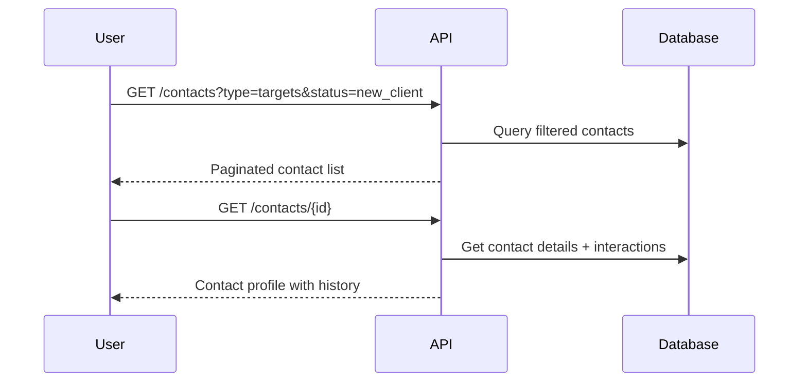
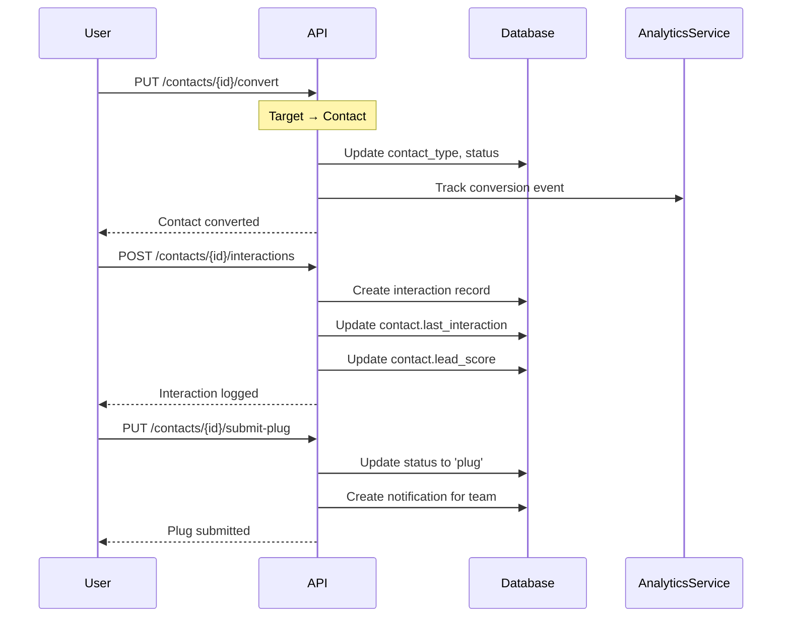
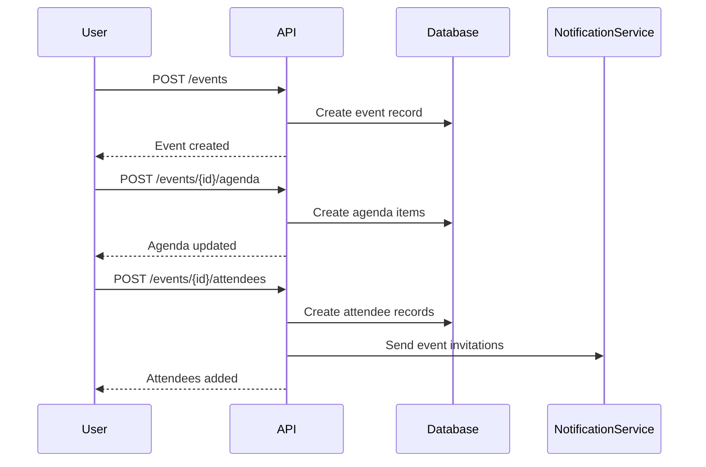
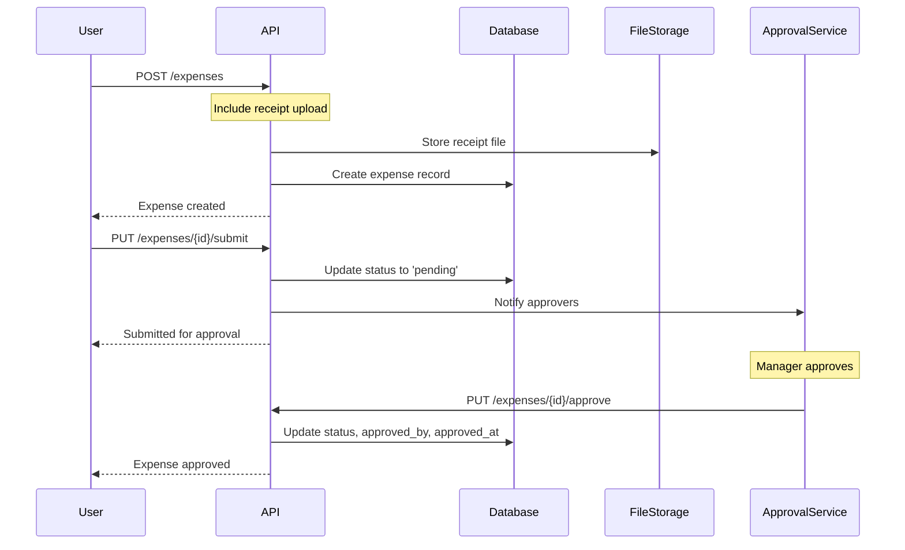
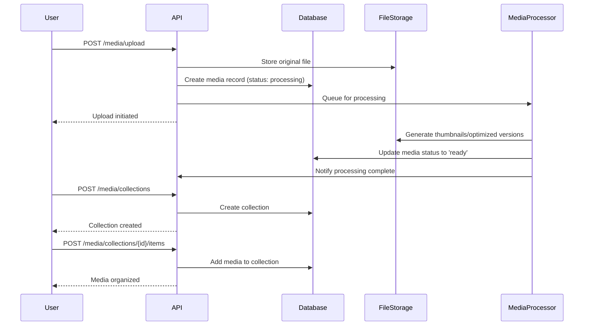
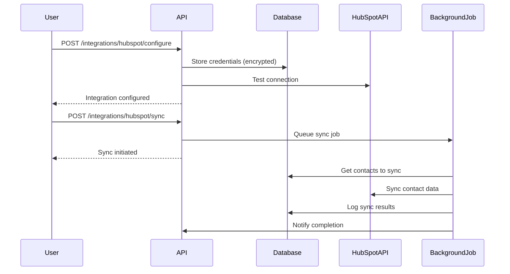
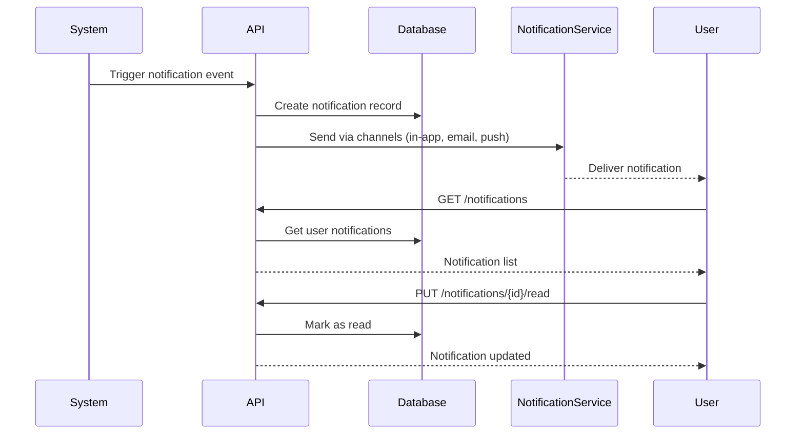

# The Plugs - Data Flows and Business Logic

## Overview

This document outlines the data flows and business logic for **The Plugs** platform based on the Figma UI designs. Each flow corresponds to specific user journeys and interactions shown in the mockups.

## 1. Authentication Flow

### 1.1 User Registration & Login (Screens 2.1-2.3)

**Flow**: Registration → Email Verification → Login → Dashboard



**Database Operations**:
1. Insert into `users` table with `is_verified=false`
2. Store OTP in Redis with 10-minute expiration
3. Update `users.is_verified=true` on successful verification
4. Update `users.last_login` on successful login

### 1.2 Password Reset Flow (Screen 2.2)

**Flow**: Request Reset → Email Verification → New Password → Login



## 2. Dashboard Flow

### 2.1 Dashboard Data Loading (Screen 3)

**Data Components**:
- User statistics (Events: 16, Leads: 24, Contacts: 56, Media Drops: 88)
- Upcoming events
- Recent plugs/contacts
- Latest media drops



**Database Queries**:
```sql
-- User statistics
SELECT 
    COUNT(CASE WHEN type = 'event' THEN 1 END) as events_count,
    COUNT(CASE WHEN type = 'contact' AND status = 'hot_lead' THEN 1 END) as leads_count,
    COUNT(CASE WHEN type = 'contact' THEN 1 END) as contacts_count,
    COUNT(CASE WHEN type = 'media' THEN 1 END) as media_count
FROM (
    SELECT 'event' as type, null as status FROM events WHERE organization_id = ? AND NOT is_deleted
    UNION ALL
    SELECT 'contact' as type, status FROM contacts WHERE organization_id = ? AND NOT is_deleted
    UNION ALL
    SELECT 'media' as type, null as status FROM media WHERE organization_id = ? AND NOT is_deleted
) stats;

-- Recent events
SELECT * FROM events 
WHERE organization_id = ? AND NOT is_deleted 
ORDER BY start_date ASC LIMIT 5;

-- Recent contacts
SELECT * FROM contacts 
WHERE organization_id = ? AND NOT is_deleted 
ORDER BY created_at DESC LIMIT 10;
```

## 3. Networking/Contact Management Flow

### 3.1 Contact Listing & Filtering (Screens 4.1-4.2)

**Flow**: View Targets/Contacts → Filter by Status → View Details



**Database Operations**:
```sql
-- Filtered contact listing
SELECT c.*, COUNT(ci.id) as interaction_count,
       MAX(ci.interaction_date) as last_interaction
FROM contacts c
LEFT JOIN contact_interactions ci ON c.id = ci.contact_id AND NOT ci.is_deleted
WHERE c.organization_id = ? AND c.contact_type = ? 
  AND (? IS NULL OR c.status = ?)
  AND NOT c.is_deleted
GROUP BY c.id
ORDER BY c.updated_at DESC
LIMIT ? OFFSET ?;
```

### 3.2 Contact Conversion Flow (Screens 4.3-4.8)

**Flow**: Target → Contact → Plug → Lead Conversion



### 3.3 Contact Profile Management (Screens 4.3-4.4)

**Data Structure**:
- Basic info (name, email, company, role)
- Professional details (LinkedIn, industry, business type)
- Networking classification (network type, priority)
- Interaction history
- Notes and metadata

```sql
-- Get complete contact profile
SELECT 
    c.*,
    u.first_name || ' ' || u.last_name as created_by_name,
    COUNT(ci.id) as total_interactions,
    MAX(ci.interaction_date) as last_interaction_date,
    STRING_AGG(DISTINCT ci.interaction_type, ', ') as interaction_types
FROM contacts c
JOIN users u ON c.created_by = u.id
LEFT JOIN contact_interactions ci ON c.id = ci.contact_id AND NOT ci.is_deleted
WHERE c.id = ? AND c.organization_id = ? AND NOT c.is_deleted
GROUP BY c.id, u.first_name, u.last_name;
```

## 4. Event Management Flow

### 4.1 Event Creation & Management (Screens 5.1-5.6)

**Flow**: Create Event → Add Agenda → Manage Attendees → Track Analytics



**Database Operations**:
```sql
-- Create event with agenda
INSERT INTO events (organization_id, created_by, title, description, start_date, end_date, ...)
VALUES (?, ?, ?, ?, ?, ?, ...);

-- Add agenda items
INSERT INTO event_agenda_items (organization_id, event_id, created_by, title, start_time, end_time, ...)
VALUES (?, ?, ?, ?, ?, ?, ...);

-- Register attendees
INSERT INTO event_attendees (organization_id, event_id, user_id, status)
VALUES (?, ?, ?, 'registered');
```

### 4.2 Event Analytics & Tracking (Screens 5.5-5.6)

**Metrics Tracked**:
- Attendance rates
- Check-in/check-out times
- Agenda participation
- Budget vs actual expenses

```sql
-- Event analytics query
SELECT 
    e.id,
    e.title,
    e.max_attendees,
    e.current_attendees,
    COUNT(CASE WHEN ea.status = 'attended' THEN 1 END) as actual_attendees,
    COUNT(CASE WHEN ea.status = 'no_show' THEN 1 END) as no_shows,
    SUM(exp.amount) as total_expenses,
    e.budget,
    (SUM(exp.amount) / NULLIF(e.budget, 0)) * 100 as budget_utilization
FROM events e
LEFT JOIN event_attendees ea ON e.id = ea.event_id AND NOT ea.is_deleted
LEFT JOIN expenses exp ON e.id = exp.event_id AND NOT exp.is_deleted
WHERE e.id = ? AND e.organization_id = ?
GROUP BY e.id;
```

## 5. Expense Management Flow

### 5.1 Expense Tracking (Screens 5.7-5.10)

**Flow**: Create Expense → Categorize → Submit for Approval → Track Status



**Database Operations**:
```sql
-- Create expense with file reference
INSERT INTO expenses (
    organization_id, created_by, event_id, title, description,
    amount, currency, category, expense_type, expense_date,
    receipt_url, status
) VALUES (?, ?, ?, ?, ?, ?, ?, ?, ?, ?, ?, 'pending');

-- Approve expense
UPDATE expenses 
SET status = 'approved', approved_by = ?, approved_at = NOW()
WHERE id = ? AND organization_id = ?;
```

## 6. Media Management Flow

### 6.1 Media Upload & Organization (Screens 5.11-5.17)

**Flow**: Upload Media → Process/Optimize → Organize in Collections → Associate with Events/Contacts



### 6.2 Media Associations (Screens 5.12-5.16)

**Associations**:
- Event photos/videos
- Contact profile images
- General media library
- Snap collections (fleeting content)

```sql
-- Associate media with event
UPDATE media 
SET related_event = ?, access_level = 'organization'
WHERE id = ? AND organization_id = ?;

-- Create media collection for event
INSERT INTO media_collections (organization_id, created_by, name, collection_type)
VALUES (?, ?, 'Event Photos - ' || ?, 'event_photos');

-- Add media to collection
INSERT INTO media_collection_items (collection_id, media_id, sort_order)
VALUES (?, ?, ?);
```

## 7. Integration & Sync Flow

### 7.1 HubSpot Sync (Screens 5.22-5.23)

**Flow**: Configure Integration → Sync Contacts → Export Data → Monitor Status



**Database Operations**:
```sql
-- Store integration configuration
INSERT INTO integrations (
    organization_id, provider, integration_type, 
    credentials, settings, status
) VALUES (?, 'hubspot', 'crm', ?, ?, 'connected');

-- Log sync operation
INSERT INTO integration_logs (
    organization_id, integration_id, operation, status,
    started_at, records_processed, records_failed
) VALUES (?, ?, 'sync', 'success', ?, ?, ?);
```

### 7.2 CSV Export Flow (Screen 5.22)

**Export Types**:
- Contact lists with interaction history
- Event attendee lists
- Expense reports
- Media inventory

```sql
-- Export contacts with interaction summary
SELECT 
    c.first_name, c.last_name, c.email, c.company, c.job_title,
    c.contact_type, c.status, c.priority, c.lead_score,
    COUNT(ci.id) as total_interactions,
    MAX(ci.interaction_date) as last_interaction,
    STRING_AGG(ci.interaction_type, ', ') as interaction_types
FROM contacts c
LEFT JOIN contact_interactions ci ON c.id = ci.contact_id AND NOT ci.is_deleted
WHERE c.organization_id = ? AND NOT c.is_deleted
GROUP BY c.id
ORDER BY c.last_name, c.first_name;
```

## 8. Notification & Communication Flow

### 8.1 Real-time Notifications

**Notification Types**:
- Event reminders
- Contact interaction updates
- Expense approval status
- System alerts



## Performance Optimization

### Caching Strategy
- Dashboard statistics: 5-minute cache
- User profile data: 30-minute cache
- Event lists: 10-minute cache
- Media thumbnails: 24-hour cache

### Database Optimization
- Composite indexes on `(organization_id, created_at)`
- Full-text search indexes on contact/event names
- Partitioning for analytics and audit tables
- Read replicas for reporting queries

### Background Processing
- Media processing (thumbnails, optimization)
- Email notifications
- Data synchronization
- Analytics aggregation

---

*This data flow documentation provides comprehensive coverage of all user journeys and system interactions shown in the Figma designs.*
