# The Plugs - Entity Relationship Diagram

## Complete ERD Diagram

```mermaid
erDiagram
    %% Core Entities
    organizations {
        uuid id PK
        string name
        string domain
        string subscription_plan
        json settings
        boolean is_active
        datetime created_at
        datetime updated_at
        boolean is_deleted
        datetime deleted_at
    }

    users {
        uuid id PK
        uuid organization_id FK
        string email UK
        string password_hash
        string first_name
        string last_name
        string phone
        text bio
        string avatar_url
        string job_title
        string company
        string linkedin_url
        boolean is_active
        boolean is_verified
        boolean is_admin
        datetime verified_at
        datetime last_login
        datetime created_at
        datetime updated_at
        boolean is_deleted
        datetime deleted_at
        uuid created_by FK
        uuid updated_by FK
    }

    contacts {
        uuid id PK
        uuid organization_id FK
        uuid created_by FK
        string first_name
        string last_name
        string email
        string phone
        string company
        string job_title
        string linkedin_url
        text bio
        string avatar_url
        string contact_type "target|contact|plug"
        string status "new_client|existing_client|hot_lead|cold_lead"
        string priority "high|medium|low"
        string business_type
        string network_type
        string industry
        text notes
        json metadata
        integer lead_score
        datetime last_interaction
        datetime created_at
        datetime updated_at
        boolean is_deleted
        datetime deleted_at
        uuid updated_by FK
    }

    contact_interactions {
        uuid id PK
        uuid organization_id FK
        uuid contact_id FK
        uuid user_id FK
        string interaction_type "meeting|call|email|linkedin|event|follow_up"
        string subject
        text description
        text outcome
        datetime interaction_date
        string status "completed|scheduled|cancelled"
        json metadata
        datetime created_at
        datetime updated_at
        boolean is_deleted
        datetime deleted_at
    }

    events {
        uuid id PK
        uuid organization_id FK
        uuid created_by FK
        string title
        text description
        string event_type "conference|workshop|networking|meeting"
        string status "draft|published|ongoing|completed|cancelled"
        datetime start_date
        datetime end_date
        string timezone
        string location
        string venue
        json venue_details
        decimal budget
        string currency
        integer max_attendees
        integer current_attendees
        string registration_url
        json settings
        json metadata
        datetime created_at
        datetime updated_at
        boolean is_deleted
        datetime deleted_at
        uuid updated_by FK
    }

    event_attendees {
        uuid id PK
        uuid organization_id FK
        uuid event_id FK
        uuid user_id FK
        string status "registered|confirmed|attended|no_show|cancelled"
        datetime registration_date
        datetime check_in_time
        datetime check_out_time
        text notes
        json metadata
        datetime created_at
        datetime updated_at
        boolean is_deleted
        datetime deleted_at
    }

    event_agenda_items {
        uuid id PK
        uuid organization_id FK
        uuid event_id FK
        uuid created_by FK
        string title
        text description
        datetime start_time
        datetime end_time
        string agenda_type "presentation|break|networking|workshop"
        string location
        uuid speaker_id FK
        integer sort_order
        string status "scheduled|ongoing|completed|cancelled"
        json metadata
        datetime created_at
        datetime updated_at
        boolean is_deleted
        datetime deleted_at
    }

    expenses {
        uuid id PK
        uuid organization_id FK
        uuid created_by FK
        uuid event_id FK
        string title
        text description
        decimal amount
        string currency
        string category
        string expense_type "travel|accommodation|catering|venue|marketing|other"
        datetime expense_date
        string status "pending|approved|rejected|paid"
        string receipt_url
        text notes
        uuid approved_by FK
        datetime approved_at
        json metadata
        datetime created_at
        datetime updated_at
        boolean is_deleted
        datetime deleted_at
    }

    media {
        uuid id PK
        uuid organization_id FK
        uuid uploaded_by FK
        string title
        text description
        string file_name
        string file_path
        string file_url
        string media_type "image|video|document|audio"
        string mime_type
        bigint file_size
        json metadata
        string status "processing|ready|failed"
        uuid related_event FK
        uuid related_contact FK
        string access_level "public|private|organization"
        json tags
        datetime created_at
        datetime updated_at
        boolean is_deleted
        datetime deleted_at
    }

    media_collections {
        uuid id PK
        uuid organization_id FK
        uuid created_by FK
        string name
        text description
        string collection_type "event_photos|contact_media|general"
        json settings
        datetime created_at
        datetime updated_at
        boolean is_deleted
        datetime deleted_at
    }

    media_collection_items {
        uuid id PK
        uuid collection_id FK
        uuid media_id FK
        integer sort_order
        datetime created_at
    }

    notifications {
        uuid id PK
        uuid organization_id FK
        uuid user_id FK
        string title
        text message
        string notification_type "info|success|warning|error|reminder"
        string channel "in_app|email|sms|push"
        json data
        boolean is_read
        datetime read_at
        datetime expires_at
        datetime created_at
        datetime updated_at
        boolean is_deleted
    }

    integrations {
        uuid id PK
        uuid organization_id FK
        string provider "hubspot|mailchimp|zoom|teams"
        string integration_type "crm|email|video|calendar"
        json credentials
        json settings
        boolean is_active
        datetime last_sync
        string status "connected|disconnected|error"
        json metadata
        datetime created_at
        datetime updated_at
        boolean is_deleted
        datetime deleted_at
    }

    integration_logs {
        uuid id PK
        uuid organization_id FK
        uuid integration_id FK
        string operation "sync|export|import|webhook"
        string status "success|failed|partial"
        text message
        json request_data
        json response_data
        datetime started_at
        datetime completed_at
        integer records_processed
        integer records_failed
        json error_details
        datetime created_at
    }

    analytics_events {
        uuid id PK
        uuid organization_id FK
        uuid user_id FK
        string event_name
        string event_category
        json properties
        string session_id
        string ip_address
        string user_agent
        datetime event_timestamp
        datetime created_at
    }

    audit_logs {
        uuid id PK
        uuid organization_id FK
        uuid user_id FK
        string table_name
        uuid record_id
        string action "create|update|delete|restore"
        json old_values
        json new_values
        json metadata
        datetime created_at
    }

    %% Relationships
    organizations ||--o{ users : "belongs_to"
    organizations ||--o{ contacts : "belongs_to"
    organizations ||--o{ events : "belongs_to"
    organizations ||--o{ media : "belongs_to"
    organizations ||--o{ expenses : "belongs_to"
    organizations ||--o{ notifications : "belongs_to"
    organizations ||--o{ integrations : "belongs_to"

    users ||--o{ contacts : "created_by"
    users ||--o{ events : "created_by"
    users ||--o{ media : "uploaded_by"
    users ||--o{ expenses : "created_by"
    users ||--o{ contact_interactions : "performed_by"
    users ||--o{ event_agenda_items : "created_by"
    users ||--o{ media_collections : "created_by"

    contacts ||--o{ contact_interactions : "has_interactions"
    contacts ||--o{ media : "related_to"

    events ||--o{ event_attendees : "has_attendees"
    events ||--o{ event_agenda_items : "has_agenda_items"
    events ||--o{ expenses : "has_expenses"
    events ||--o{ media : "has_media"

    users ||--o{ event_attendees : "attends"
    users ||--o{ event_agenda_items : "speaks_at"

    media_collections ||--o{ media_collection_items : "contains"
    media ||--o{ media_collection_items : "belongs_to"

    integrations ||--o{ integration_logs : "has_logs"

    users ||--o{ notifications : "receives"
    users ||--o{ analytics_events : "generates"
    users ||--o{ audit_logs : "performs_action"
```

## Key Relationships Explained

### Core Business Relationships

1. **Organization → Users**: Multi-tenant isolation
2. **Users → Contacts**: Professional networking management
3. **Contacts → Interactions**: Relationship tracking
4. **Events → Attendees**: Event participation
5. **Events → Agenda**: Detailed event scheduling
6. **Events → Expenses**: Financial tracking
7. **Media → Collections**: Content organization

### Cross-Entity Relationships

1. **Media ↔ Events**: Event documentation
2. **Media ↔ Contacts**: Contact-related content
3. **Users ↔ Event Attendees**: Participation tracking
4. **Integrations ↔ Logs**: System integration monitoring

## Entity Categories

### **Core Business Entities**
- Organizations, Users, Contacts, Events

### **Relationship Management**
- Contact Interactions, Event Attendees, Event Agenda Items

### **Content Management**
- Media, Media Collections, Media Collection Items

### **Financial Management**
- Expenses

### **Communication**
- Notifications

### **System Integration**
- Integrations, Integration Logs

### **Analytics & Audit**
- Analytics Events, Audit Logs

---

*This ERD represents the complete data model for The Plugs enterprise networking platform, supporting all features shown in the Figma designs.*
