# The Plugs - Visual Entity Relationship Diagram

## Complete Database ERD with Detailed Relationships

```mermaid
erDiagram
    %% Core Multi-Tenant Foundation
    ORGANIZATIONS {
        uuid id PK "Primary Key"
        varchar name "Organization Name"
        varchar domain "Email Domain"
        varchar subscription_plan "free|pro|enterprise"
        jsonb settings "Organization Settings"
        boolean is_active "Active Status"
        timestamp created_at "Creation Date"
        timestamp updated_at "Last Modified"
        boolean is_deleted "Soft Delete Flag"
        timestamp deleted_at "Deletion Date"
    }

    %% User Management & Authentication
    USERS {
        uuid id PK "Primary Key"
        uuid organization_id FK "Organization Reference"
        varchar email UK "Unique Email per Org"
        varchar password_hash "Encrypted Password"
        varchar first_name "First Name"
        varchar last_name "Last Name"
        varchar phone "Phone Number"
        text bio "User Biography"
        varchar avatar_url "Profile Picture URL"
        varchar job_title "Professional Title"
        varchar company "Company Name"
        varchar linkedin_url "LinkedIn Profile"
        boolean is_active "Account Active"
        boolean is_verified "Email Verified"
        boolean is_admin "Admin Privileges"
        timestamp verified_at "Verification Date"
        timestamp last_login "Last Login Time"
        timestamp created_at "Account Created"
        timestamp updated_at "Profile Updated"
        boolean is_deleted "Soft Delete"
        timestamp deleted_at "Deletion Date"
        uuid created_by FK "Created By User"
        uuid updated_by FK "Modified By User"
    }

    %% Professional Networking
    CONTACTS {
        uuid id PK "Primary Key"
        uuid organization_id FK "Organization Scope"
        uuid created_by FK "Creator User"
        varchar first_name "Contact First Name"
        varchar last_name "Contact Last Name"
        varchar email "Contact Email"
        varchar phone "Contact Phone"
        varchar company "Contact Company"
        varchar job_title "Professional Role"
        varchar linkedin_url "LinkedIn Profile"
        text bio "Contact Biography"
        varchar avatar_url "Profile Image"
        varchar contact_type "target|contact|plug"
        varchar status "new_client|existing_client|hot_lead|cold_lead"
        varchar priority "high|medium|low"
        varchar business_type "Business Classification"
        varchar network_type "Network Category"
        varchar industry "Industry Sector"
        text notes "Internal Notes"
        jsonb metadata "Additional Data"
        int lead_score "0-100 Score"
        timestamp last_interaction "Last Contact Date"
        timestamp created_at "Record Created"
        timestamp updated_at "Record Modified"
        boolean is_deleted "Soft Delete"
        timestamp deleted_at "Deletion Date"
        uuid updated_by FK "Last Modified By"
    }

    CONTACT_INTERACTIONS {
        uuid id PK "Primary Key"
        uuid organization_id FK "Organization Scope"
        uuid contact_id FK "Related Contact"
        uuid user_id FK "Interaction User"
        varchar interaction_type "meeting|call|email|linkedin|event|follow_up"
        varchar subject "Interaction Subject"
        text description "Detailed Description"
        text outcome "Interaction Result"
        timestamp interaction_date "When Occurred"
        varchar status "completed|scheduled|cancelled"
        jsonb metadata "Additional Context"
        timestamp created_at "Record Created"
        timestamp updated_at "Record Modified"
        boolean is_deleted "Soft Delete"
        timestamp deleted_at "Deletion Date"
    }

    %% Event Management System
    EVENTS {
        uuid id PK "Primary Key"
        uuid organization_id FK "Organization Scope"
        uuid created_by FK "Event Creator"
        varchar title "Event Title"
        text description "Event Description"
        varchar event_type "conference|workshop|networking|meeting"
        varchar status "draft|published|ongoing|completed|cancelled"
        timestamp start_date "Event Start"
        timestamp end_date "Event End"
        varchar timezone "Time Zone"
        varchar location "Event Location"
        varchar venue "Venue Name"
        jsonb venue_details "Venue Information"
        decimal budget "Event Budget"
        varchar currency "Currency Code"
        int max_attendees "Maximum Capacity"
        int current_attendees "Current Count"
        varchar registration_url "Registration Link"
        jsonb settings "Event Settings"
        jsonb metadata "Additional Data"
        timestamp created_at "Created Date"
        timestamp updated_at "Modified Date"
        boolean is_deleted "Soft Delete"
        timestamp deleted_at "Deletion Date"
        uuid updated_by FK "Last Modified By"
    }

    EVENT_ATTENDEES {
        uuid id PK "Primary Key"
        uuid organization_id FK "Organization Scope"
        uuid event_id FK "Event Reference"
        uuid user_id FK "Attendee User"
        varchar status "registered|confirmed|attended|no_show|cancelled"
        timestamp registration_date "Registration Time"
        timestamp check_in_time "Check-in Time"
        timestamp check_out_time "Check-out Time"
        text notes "Attendee Notes"
        jsonb metadata "Additional Data"
        timestamp created_at "Record Created"
        timestamp updated_at "Record Modified"
        boolean is_deleted "Soft Delete"
        timestamp deleted_at "Deletion Date"
    }

    EVENT_AGENDA_ITEMS {
        uuid id PK "Primary Key"
        uuid organization_id FK "Organization Scope"
        uuid event_id FK "Event Reference"
        uuid created_by FK "Creator User"
        varchar title "Agenda Item Title"
        text description "Item Description"
        timestamp start_time "Start Time"
        timestamp end_time "End Time"
        varchar agenda_type "presentation|break|networking|workshop"
        varchar location "Session Location"
        uuid speaker_id FK "Speaker User"
        int sort_order "Display Order"
        varchar status "scheduled|ongoing|completed|cancelled"
        jsonb metadata "Additional Data"
        timestamp created_at "Created Date"
        timestamp updated_at "Modified Date"
        boolean is_deleted "Soft Delete"
        timestamp deleted_at "Deletion Date"
    }

    %% Financial Management
    EXPENSES {
        uuid id PK "Primary Key"
        uuid organization_id FK "Organization Scope"
        uuid created_by FK "Expense Creator"
        uuid event_id FK "Related Event"
        varchar title "Expense Title"
        text description "Expense Description"
        decimal amount "Expense Amount"
        varchar currency "Currency Code"
        varchar category "Expense Category"
        varchar expense_type "travel|accommodation|catering|venue|marketing|other"
        date expense_date "Expense Date"
        varchar status "pending|approved|rejected|paid"
        varchar receipt_url "Receipt File URL"
        text notes "Additional Notes"
        uuid approved_by FK "Approver User"
        timestamp approved_at "Approval Date"
        jsonb metadata "Additional Data"
        timestamp created_at "Created Date"
        timestamp updated_at "Modified Date"
        boolean is_deleted "Soft Delete"
        timestamp deleted_at "Deletion Date"
    }

    %% Media & Content Management
    MEDIA {
        uuid id PK "Primary Key"
        uuid organization_id FK "Organization Scope"
        uuid uploaded_by FK "Uploader User"
        varchar title "Media Title"
        text description "Media Description"
        varchar file_name "Original Filename"
        varchar file_path "Storage Path"
        varchar file_url "Access URL"
        varchar media_type "image|video|document|audio"
        varchar mime_type "MIME Type"
        bigint file_size "File Size Bytes"
        jsonb metadata "File Metadata"
        varchar status "processing|ready|failed"
        uuid related_event FK "Related Event"
        uuid related_contact FK "Related Contact"
        varchar access_level "public|private|organization"
        jsonb tags "Content Tags"
        timestamp created_at "Upload Date"
        timestamp updated_at "Modified Date"
        boolean is_deleted "Soft Delete"
        timestamp deleted_at "Deletion Date"
    }

    MEDIA_COLLECTIONS {
        uuid id PK "Primary Key"
        uuid organization_id FK "Organization Scope"
        uuid created_by FK "Creator User"
        varchar name "Collection Name"
        text description "Collection Description"
        varchar collection_type "event_photos|contact_media|general"
        jsonb settings "Collection Settings"
        timestamp created_at "Created Date"
        timestamp updated_at "Modified Date"
        boolean is_deleted "Soft Delete"
        timestamp deleted_at "Deletion Date"
    }

    MEDIA_COLLECTION_ITEMS {
        uuid id PK "Primary Key"
        uuid collection_id FK "Collection Reference"
        uuid media_id FK "Media Reference"
        int sort_order "Display Order"
        timestamp created_at "Added Date"
    }

    %% Communication System
    NOTIFICATIONS {
        uuid id PK "Primary Key"
        uuid organization_id FK "Organization Scope"
        uuid user_id FK "Recipient User"
        varchar title "Notification Title"
        text message "Notification Message"
        varchar notification_type "info|success|warning|error|reminder"
        varchar channel "in_app|email|sms|push"
        jsonb data "Notification Data"
        boolean is_read "Read Status"
        timestamp read_at "Read Time"
        timestamp expires_at "Expiration Time"
        timestamp created_at "Created Date"
        timestamp updated_at "Modified Date"
        boolean is_deleted "Soft Delete"
    }

    %% System Integration
    INTEGRATIONS {
        uuid id PK "Primary Key"
        uuid organization_id FK "Organization Scope"
        varchar provider "hubspot|mailchimp|zoom|teams"
        varchar integration_type "crm|email|video|calendar"
        jsonb credentials "Encrypted Credentials"
        jsonb settings "Integration Settings"
        boolean is_active "Active Status"
        timestamp last_sync "Last Sync Time"
        varchar status "connected|disconnected|error"
        jsonb metadata "Additional Data"
        timestamp created_at "Created Date"
        timestamp updated_at "Modified Date"
        boolean is_deleted "Soft Delete"
        timestamp deleted_at "Deletion Date"
    }

    INTEGRATION_LOGS {
        uuid id PK "Primary Key"
        uuid organization_id FK "Organization Scope"
        uuid integration_id FK "Integration Reference"
        varchar operation "sync|export|import|webhook"
        varchar status "success|failed|partial"
        text message "Log Message"
        jsonb request_data "Request Data"
        jsonb response_data "Response Data"
        timestamp started_at "Start Time"
        timestamp completed_at "Completion Time"
        int records_processed "Success Count"
        int records_failed "Failure Count"
        jsonb error_details "Error Information"
        timestamp created_at "Log Date"
    }

    %% Analytics & Audit
    ANALYTICS_EVENTS {
        uuid id PK "Primary Key"
        uuid organization_id FK "Organization Scope"
        uuid user_id FK "Event User"
        varchar event_name "Event Name"
        varchar event_category "Event Category"
        jsonb properties "Event Properties"
        varchar session_id "Session ID"
        inet ip_address "IP Address"
        text user_agent "User Agent"
        timestamp event_timestamp "Event Time"
        timestamp created_at "Record Date"
    }

    AUDIT_LOGS {
        uuid id PK "Primary Key"
        uuid organization_id FK "Organization Scope"
        uuid user_id FK "Acting User"
        varchar table_name "Target Table"
        uuid record_id "Record ID"
        varchar action "create|update|delete|restore"
        jsonb old_values "Previous Values"
        jsonb new_values "New Values"
        jsonb metadata "Audit Metadata"
        timestamp created_at "Audit Date"
    }

    %% Primary Relationships
    ORGANIZATIONS ||--o{ USERS : "owns"
    ORGANIZATIONS ||--o{ CONTACTS : "contains"
    ORGANIZATIONS ||--o{ EVENTS : "hosts"
    ORGANIZATIONS ||--o{ MEDIA : "stores"
    ORGANIZATIONS ||--o{ EXPENSES : "tracks"
    ORGANIZATIONS ||--o{ NOTIFICATIONS : "sends"
    ORGANIZATIONS ||--o{ INTEGRATIONS : "configures"
    ORGANIZATIONS ||--o{ ANALYTICS_EVENTS : "generates"
    ORGANIZATIONS ||--o{ AUDIT_LOGS : "maintains"

    %% User Relationships
    USERS ||--o{ CONTACTS : "creates"
    USERS ||--o{ EVENTS : "organizes"
    USERS ||--o{ MEDIA : "uploads"
    USERS ||--o{ EXPENSES : "submits"
    USERS ||--o{ CONTACT_INTERACTIONS : "performs"
    USERS ||--o{ EVENT_AGENDA_ITEMS : "creates"
    USERS ||--o{ MEDIA_COLLECTIONS : "manages"
    USERS ||--o{ NOTIFICATIONS : "receives"
    USERS ||--o{ ANALYTICS_EVENTS : "triggers"

    %% Contact Relationships
    CONTACTS ||--o{ CONTACT_INTERACTIONS : "has"
    CONTACTS ||--o{ MEDIA : "relates_to"

    %% Event Relationships
    EVENTS ||--o{ EVENT_ATTENDEES : "includes"
    EVENTS ||--o{ EVENT_AGENDA_ITEMS : "schedules"
    EVENTS ||--o{ EXPENSES : "incurs"
    EVENTS ||--o{ MEDIA : "documents"

    %% Attendee Relationships
    USERS ||--o{ EVENT_ATTENDEES : "attends"

    %% Speaker Relationships
    USERS ||--o{ EVENT_AGENDA_ITEMS : "speaks_at"

    %% Expense Approval
    USERS ||--o{ EXPENSES : "approves"

    %% Media Collection Relationships
    MEDIA_COLLECTIONS ||--o{ MEDIA_COLLECTION_ITEMS : "contains"
    MEDIA ||--o{ MEDIA_COLLECTION_ITEMS : "belongs_to"

    %% Integration Relationships
    INTEGRATIONS ||--o{ INTEGRATION_LOGS : "logs"

    %% Audit Relationships
    USERS ||--o{ AUDIT_LOGS : "performs"
```

## Relationship Details

### **Primary Entity Hierarchies**

1. **Organization → All Entities**
   - Complete multi-tenant isolation
   - All data scoped to organization
   - Cross-organization access impossible

2. **Users → Created Content**
   - Users create contacts, events, media
   - Audit trail via `created_by` field
   - User permissions control access

3. **Events → Related Content**
   - Events have attendees, agenda, expenses
   - Media can be associated with events
   - Complete event lifecycle tracking

### **Cross-Entity Relationships**

1. **Media Associations**
   - Can relate to events OR contacts
   - Organized in collections
   - Access control per media item

2. **Financial Tracking**
   - Expenses linked to events
   - User approval workflow
   - Budget vs. actual reporting

3. **Interaction Tracking**
   - All user actions logged
   - Contact interaction history
   - Event participation tracking

### **System Relationships**

1. **Integration Flows**
   - Third-party system connections
   - Sync operation logging
   - Error tracking and recovery

2. **Analytics & Audit**
   - User behavior tracking
   - Complete change audit
   - Compliance reporting

---

*This visual ERD provides a complete view of all entities, relationships, and data flows in The Plugs platform architecture.*

